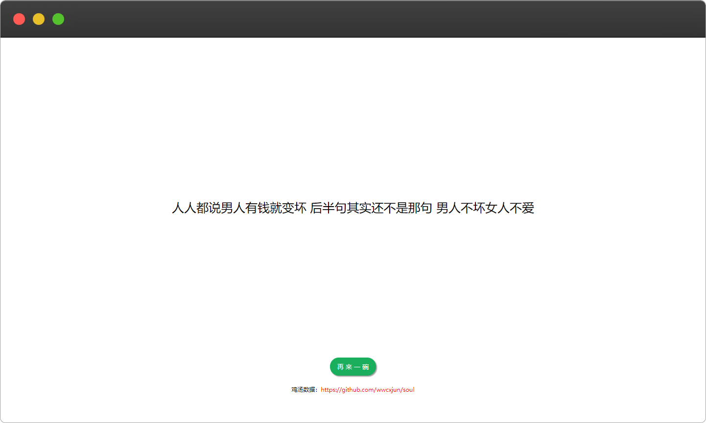

# 毒鸡汤
数据来源 https://github.com/wwcxjun/soul
## 请求URL

- `https://api.ifking.cn/api/nows`

## 请求方式

- GET/POST

## 参数


| 参数名 | 类型 | 必选 | 默认值 | 其他 | 说明 |
| :--- | :--- | :--- | --- | --- | --- |
| type | 字符串 | 否 | text | text/json/js/html | 返回类型，默认返回文本 |


## json返回示例

```json
{
    "code": 1, 
    "msg": "操作成功", 
    "data": "其实表白未必是件好事，因为那样显得手黑。"
}
```

## 网页调用
在需要的位置用引入 js 的方式进行调用即可
示例代码
```
<script src="https://api.ifking.cn/api/nows?type=js"></script>
```

## html输出示例
效果
